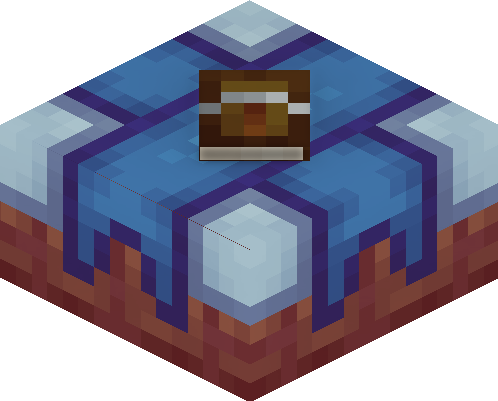

# Better on Bedrock 
## Block Wiki
Need help with how to use a block or how to find them along with their uses? This wiki has your back. Select the topic you want from the sidebar or search the block name!

**Note**: <u>When the wiki refers to `Use` or `Interact`, keep in mind that it refers to `right-click`, `LT/L2`, `Tap`.
</u>

## Bounty Board

  

### Info
The Bounty Board is a block that is provides a Bounty Scroll. This block can not be mined or obtained.

## Waystone

  

### Info
The Waystone is a utility block which is used to teleport between saved waystones, across dimensions.

### How to use
To save a waystone, you need to sneak and interact on the block with an empty hand. This will prompt a UI with instructions to follow.

To teleport between waystones, you need to interact on the block with an empty hand. This will prompt a UI with a list of waystones you have saved

### How to find
This block is found inside a Waystone Tower or Crafting.

## Forger

  

### Info
The Forger is a block that serves as a secondary Smithing Table. This block allows you to upgrade Netherite to Gilded Netherite, and also allow you to upgrade Netherite to Stardust.

### How to use
To use the Forger, hold the armor item mentioned above and interact on the block. This will open a UI with instructions to follow.

### How to find
This block is found via Crafting

## Miner Bench

  

### Info
The Miner Bench is a block that allows you to add custom enchantments to your tools. Each enchanted book is labled the tool it can be added to.

### How to use
To use the Miner Bench, you need to hold either a `pickaxe`, `axe`, `hoe` or `shears` and use the block. This will prompt a UI with instructions to follow.

### How to find
This block is found via Crafting
