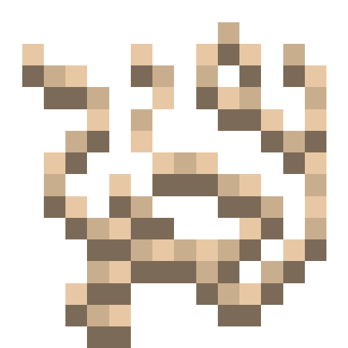
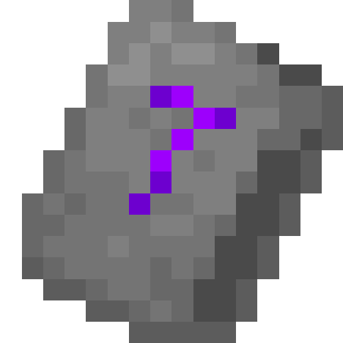
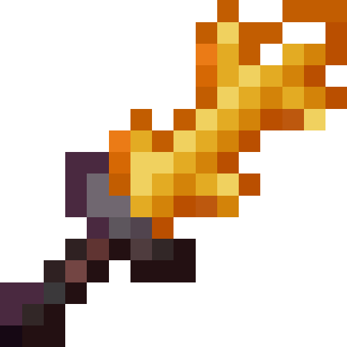

# Better on Bedrock 
## Item Wiki
Need help with how to use an item or how to find them along with their uses? This wiki has your back. Select the topic you want from the sidebar or search the item name!

## Loot bags

   

### Info
Loot bags are treasure items. Loot bags can be used to get random loot
### Where to find
Loot bags are found within the chests of Trader Outposts.

## Backpacks

   
  

### Info
Backpacks are utility items that can provide extra inventory space. They are useful when you need to carry a lot of items with you.
### Where to find
Backpacks can be crafted. There are 3 sized of backpacks: `small`, `medium` and `large`. Each backpack has its own recipe shown below
[image]
Backpacks can be shared to other player. When your backpack has 32 stone, and you give that backpacks to another player, they will see the 32 stone. You can hold more than one of the same backpack type.

## Deer Hide 
### Info

  

Deer Hide is an item dropped from Deers
### Where to find
This item is found by killing Deers

## Stronger String

  

### Info
This item is used to craft backpacks
### Where to find
This item is crafted with the recipe below.

## Quest Scroll

  

### Info
Quest scroll is an item that you receive once you load your world for the first time. This item, once opened, will reveal quests that you can complete. There are quest tiers and each tier has a set of quests. Quests do give rewards once completed.
### Where to find
The item is given once you load your world for the first time. When you lose the item, you can craft it with the recipe shown below.

## Bounty Scroll

  

### Info
The Bounty Scroll is an item that provides you bounties. These bounties consist of mobs that you got to kill for rewards
### Where to find
The Bounty Scroll can be found at a Trader Outpost. You need to use the Bounty Board block to receive the scroll.

## Magic Staffs

  

### Info
Magic staffs are items that can cast different types of spells.
### Where to find
Magic Staffs are found by trading with a Lonely Wizard. This mob spawns in a house in forest biomes. The process to obtain Staffs are a bit complex, but it will be explained below.
## Process to find

  
    

You first need to find inactive runes. These can be found by killing bosses or chest loot. Once you have your inactive rune, you then need to craft a Magic Scroll. After you crafted your scroll, you need to find a Corrupted Villager. Once found, you need to cure it with a golden apple and wait 30 seconds. Once cured you can trade with the Cured Villager. This way you can activate your runes.

## Quetzacaw Egg

  

### Info
The Quetzacaw Egg is an item that can be placed. It will place an egg that will hatch into a Friendly Quetzacaw
### Where to find
This item can be found within the chests of the Blackstone Castle

## Waystone Key

  

### Info
The Waystone Key is an item that allows you to teleport to any saved waystone once used.
### Where to find
The Waystone Key can be crafted with the recipe below.

## Ender Tear

  

### Info
This item has only one use, and that is to craft a Waystone Key
### Where to find
This item is found by killing Enderman.

## Blade of the Nether

  

### Info
This item wields the power of the nether. Any mob that you hit with this sword, will be set on fire.

::: info
This item does 12 attack damane, and has 1243 durability. This item can be repeared with a Fiery Ingot, which can be crafted.
:::

### Where to find
This item is found by killing the Shielded Pyroclast.

## Stardust

  
    

### Info
This item is used to craft a new powerful armor set
### Where to find
This item is obtained by first finding a Stardust Ore, which in return will drop a Stardust Nugget. This Nugget can be smelted into a Stardust Ingot which can then craft powerful armor and tools. You can chose to upgrade your Netherite Armor to Stardust via a Forger.

  

### Stats
| Item                | Durability | Armor Points |
|---------------------|------------|--------------|
| Stardust Chestplate | 2312       | 7            |
| Stardust Leggings   | 2000       | 7            |
| Stardust Boots      | 1500       | 3            |
| Stardust Helmet     | 1500       | 5            |

## Corstinite

  

### Info
This item is used to craft a new armor set
### Where to find
This item is obtained by first finding Costinite Ore, which in return will drop a Costinite Ingot. This Ingot can then craft armor.

  

### Stats
| Item                | Durability | Armor Points |
|---------------------|------------|--------------|
| Corstinite Chestplate | 1312 | 5            |
| Corstinite Leggings   | 1000 | 4            |
| Corstinite Boots      | 1200 | 4            |
| Corstinite Helmet     | 1100 | 6            |

## Coconut

  
  

### Info
This item is a food item.
### Where to find
This item is found inside of beach trees. Once you have a coconut, you need to break it open on stone blocks.

# Foods
## Healthy Carrot
### Info
This carrot type is healthy and gives regeneration for 5 seconds.
### Where to find
This carrot type is found by planting Wild Carrots
## Food table
| Food            | Saturation          | Effects | Crop |
|-----------------|---------------------|---------|---------|
| baguete         | 3 | None    | No|
| Baked Eggplant  | 2                  | None         | No
| Baked Onion     | 2                    | None         | No
| Barley Stew     | 6                   | None         | No
| Sweet Berry Pie | 1.5                  | None         | No
| Sweet Berry Pie Slice | 2                    | None         | No
| Cabbage Leaf | 2                    | None         | No
| Eggplant | 1                    | None         | Yes
| Grape | 2.5                     | None         | Yes
| Blueberry | 2.5                     | None         | Yes
| Healthy Carrot | 2                     | Regeneration 2         | Yes
| Onion | 1                     | None         | Yes
| Opened Coconut | 2                    | None         | No
| Orange & Peach | 2                    | None         | No
| Salad | 4                    | None         | No
| Tomato | 1                    | None         | Yes
| Wild Carrot | 2                    | None         | Yes
| Fungus Salad | 3                    | None         | No
| Lava Stew | 3                    | None         | No