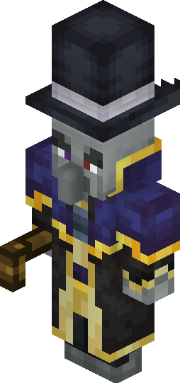
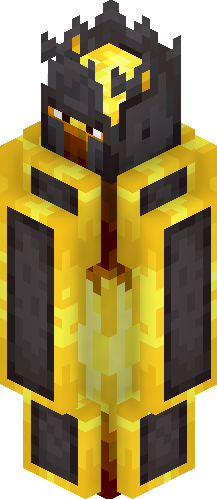

# Better on Bedrock 
## Mob Wiki
Need help with how to find mobs or what they do? This wiki has your back. Select the topic you want from the sidebar or search the block name!

## Bosses
## Willager

  

### Info
The Willager is part of the Illager Family. He is the ruler amongs them.
### Location
The Willager is found at a ruined structures. The structure contains pillars and one chest in the centre. Open the chest to summon the Willager.

## Enchantaegis

  

### Info
The Enchantaegis is part of the Illager Family. He is the one that gave them power.
### Location
The Enchantaegis is found at a ruined pyramid. The structure contains a secret room and kidnapped villager that were tested on by the Enchantaegis.

## Flender

  

### Info
The Flender is the Leader of the Phantoms.
### Location
The Flender is located on top of a quarts tower. To summon the Flender, simply walk near this tower and it will spawn.

## Shielded Pyroclast

  

### Info
The Shielded Pyroclast is the King of the Nether.
### Location
The Shielded Pyroclast is located in a battle arena found in the Nether.

## Withered Samurai

  

### Info
The Withered Samurai is the Wither Keeper
### Location
The Withered Samurai is located inside a Blacstone Caslte found in the Nether.

### Boss Stats
| **Boss**               | **Health** | **Attack Num** | **Drops**             |
|------------------------|------------|----------------|-----------------------|
| **Willager**           | 250        | 4              | - Willager Hat        |
| **Enchantaegis**       | 350        | 3              | - Enchantaegis Eye    |
| **Flender**            | 350        | 4              | - Ghost Necklace      |
| **Shielded Pyroclast** | 350        | 5              | - Blade of the Nether |
| **Withered Samurai**   | 365        | 4              | - Empty Amulet        |

## None Boss Mobs
## Racoon

  

### Info
The Racoon is a passive mob found in the overworld. This mob is really friendly and will take any gifts you give it.
### What It Does
The Racoon can not be tamed. The Racoon can dig up treasure for you at random times. The items are shown in the table below with the chance it has to spawn.
| Item                     | Drop % |
|--------------------------|--------|
| Record Mellohi           | 10     |
| Chain Armor              | 20     |
| Diamond                  | 10     |
| Gold Ingot               | 30     |
| Rotten Flesh             | 40     |
| String                   | 40     |
| Iron Pickaxe(Damaged)    | 22     |
| Arrow                    | 27     |
| Enchanted Apple          | 3      |
| Raw Iron                 | 32     |
| Spyglass                 | 7      |
| Emerald                  | 16     |
| Pottery Sherds           | 10     |
| Cherry Sapling           | 19     |
| Diamond Helmet (Damaged) | 13     |

### Breedable
This Mob can be bred with any food item

## Deers & Does

  

### Info
The deer is a passive mob. The deer has a change to spawn with an ehcnated variant. The enchanted variant gives the mob more health and better loot drops
### Drops
| **Drop**      | **%** | **Enchanted Drop** | **Enchanted %** |
|---------------|-------|--------------------|-----------------|
| **Deer Hide** | 35    | Gold & Iron Ingots | 80              |
### Breedable
This Mob can be bred with wheat

## Toucan

  

### Info
The Toucan is a passive mob. It is part of the bird family. It spawns anywhere in the Overworld. The Toucan can not be tamed.

## Squirrel

  

### Info
The squirrel is a passive mob. It is found anywhere in the Overworld. The Squirrel can not be tamed

## Goblin Trader

  

### Info
The Goblin Trader is a Passive Mob. This mob has a rare chance to spawn. This little guy can be traded with, and he has the best trades.

::: info
This mob has a 10% to spawn.
:::

::: info
 This icon refers to a custom item.
:::

### Trades

  

  

  

## Corrupted Villager

  

### Info
The Corrupted Villager is a Villager Type that is full of anger. This Mob can be cured with a Golden Apple. Once Cured, he has a trade table
### Trades
He trades Magic Scrolls and Inactive Runes for Activated Runes.
### Where to find
This mob is found within forest biomes inside a spruce house.

## Lonely Wizard

  

### Info
The Lonely Wizard is a Villager Wizard. He lives alone far from his kind.
### Trades
He trades Activated Runes for Staffs
### Where to find
This mob is found within Taiga biomes inside a big house.

## Sparrow

  

### Info
The Sparrow is a passive mob. It is part of the Bird Family. This Mob can not be tamed, but can be bred. This mob is found in the overworld.
### Breedable
This Mob can be bred with any seed

## Quetzacaw

  

### Info
The Quetzacaw is a hostile mob, found in the Nether. It is a bird. This mob can be made friendly by placing and hatching a `Quetzacaw Egg`.
### Drops
| **Drop**      | **%** |
|---------------|-------|
| **Quetzacaw Feather** | 100    |
### Breedable
This Mob can not breed.

## Hellhound

  

### Info
The Hell Hound is a wolf in the Nether. It is big. When it attacks, its target is set on fire
### Breedable
This Mob can not breed.

## Fire Wisps

  

### Info
The Fire Wisp acts as a Blaze, but weaker.

