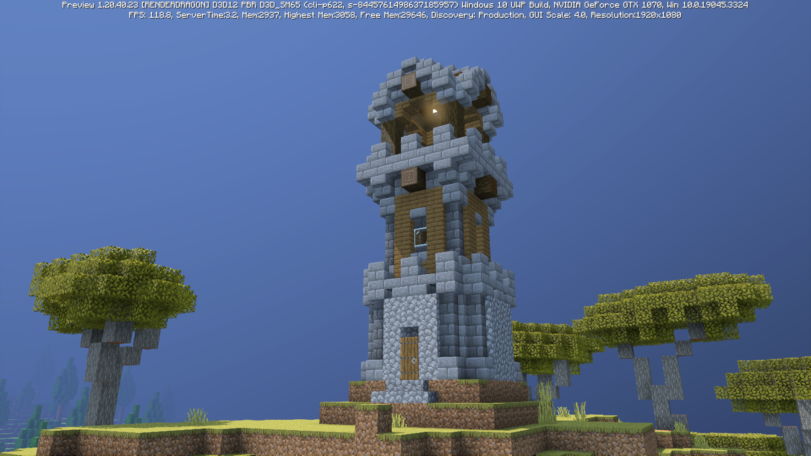
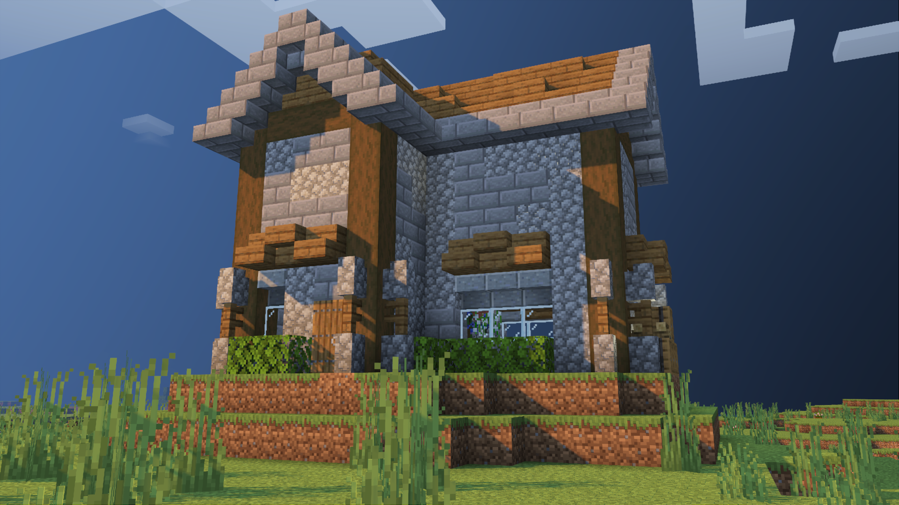
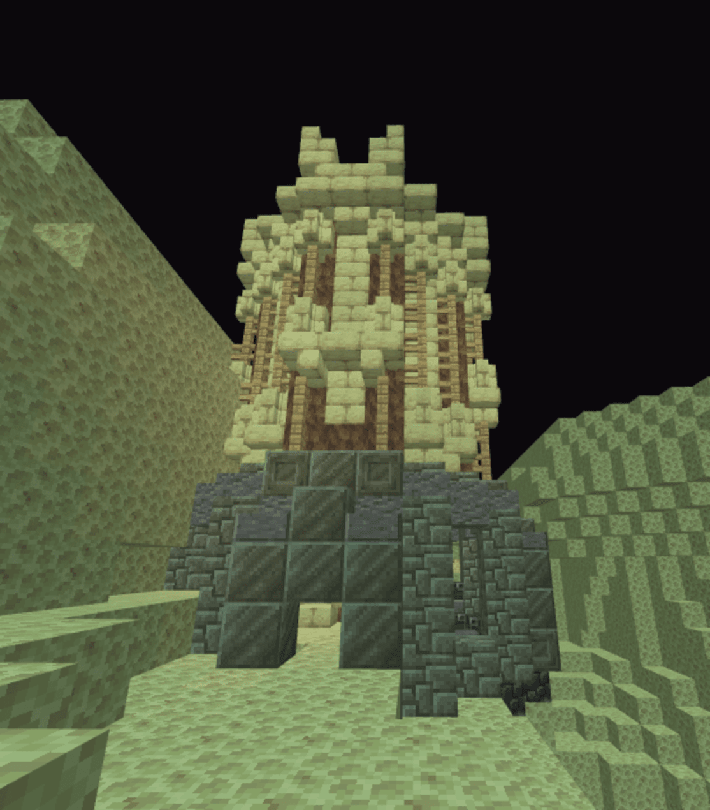
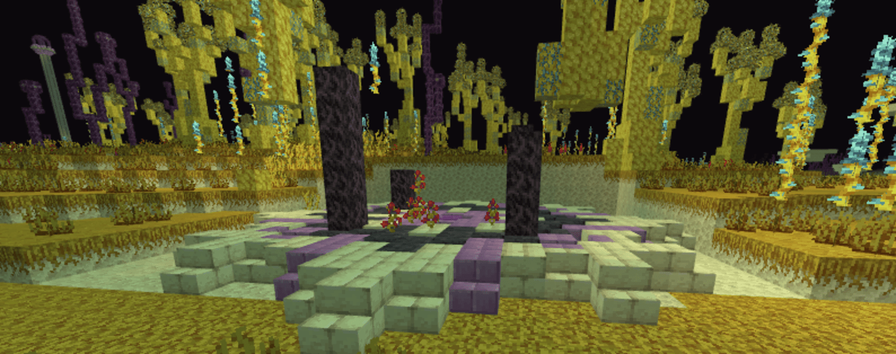
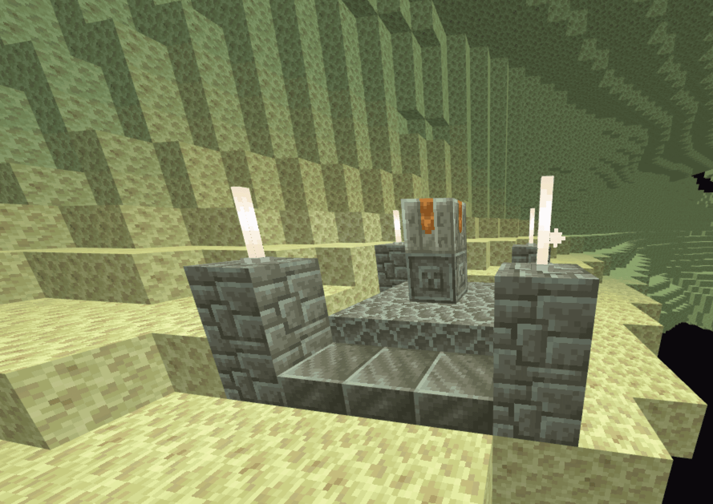
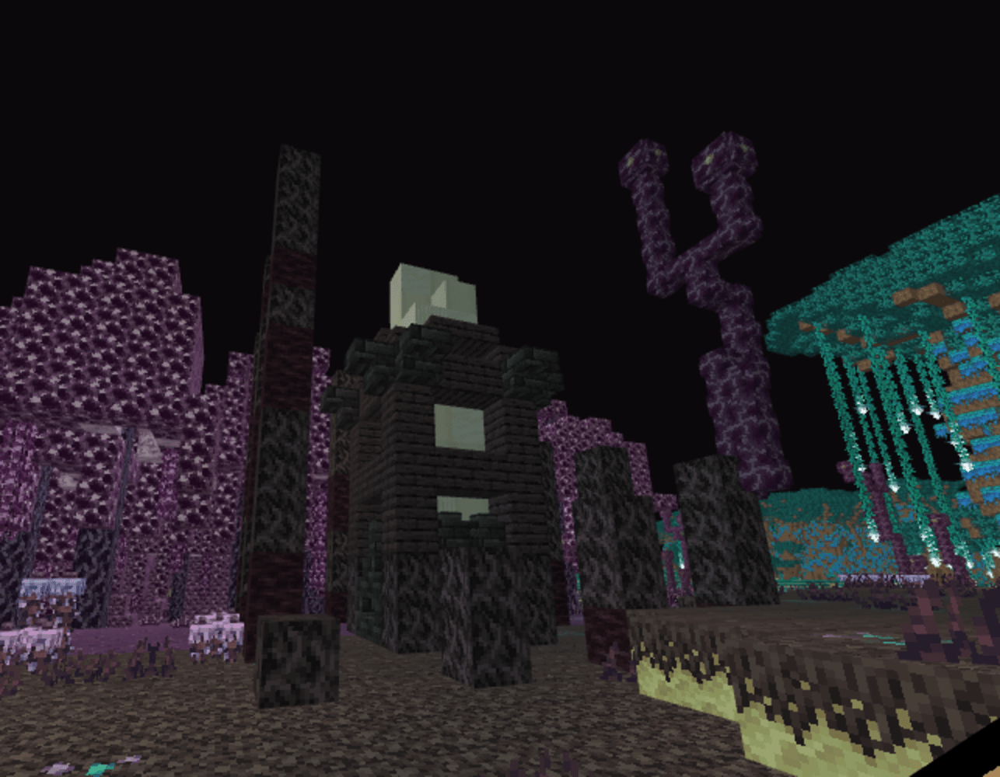
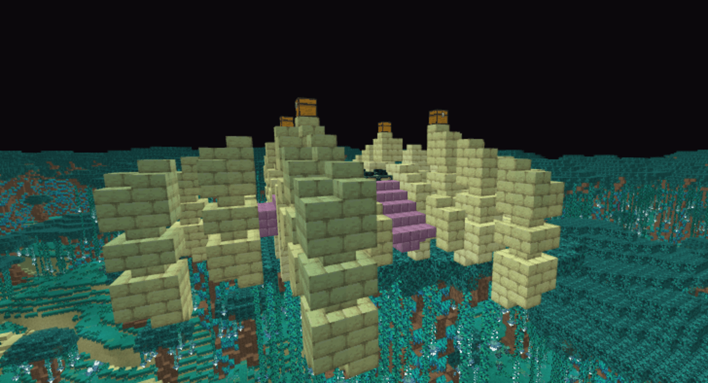
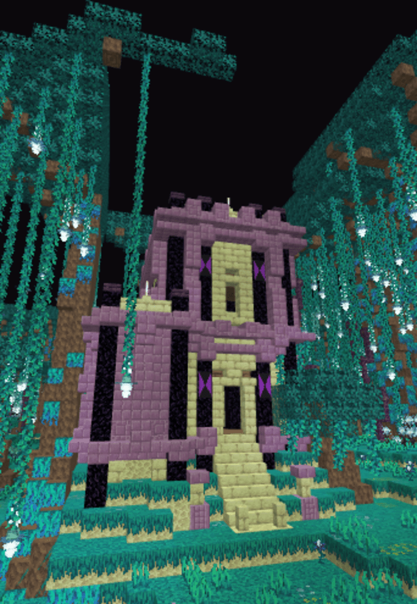

# Better on Bedrock
## Structure Wiki
Curious as to how they look and where to find them?
## Adventurer Camp

This structrue is home to one lost traveler. It was set up at random places in a world. It was his way to write a story.

#### Biomes:
- Savanna
- Taiga
- Birch Forest
- Plains

## Adventurer House

This was the permanent home to the lost traveler.
### Biomes:
- Plains
- Forests

## Enchant Tower

This is where the withces gathered when they wanted to learn new enchantments.
### Biomes:
- Plains
- Forests
- Birch Forest

## Enchantaegis

This is where you will find the Enchantaegis. He has some villagers locked up, so it is up to you to save them.
### Biomes:
- Plains
- Forests
- Birch Forest

## Flender Tower

This tower is home to the Flender. Any traveler that goes near it, will have to battle for peace.
### Biomes:
- Plains
- Forests
- Birch Forest
- Savanna

## River's Base

His music echoes the overworld.
### Biomes:
- Plains
- Forests
- Birch Forest
- Savanna

## Ruined Arena

This is where you will find the Willager. Seems innocent, but that chest seems off.
### Biomes:
- Plains
- Forests
- Birch Forest

## Ruined Temple

Ancient.
### Biomes:
- Forests
- Jungle

## Trader Outpost

This is the hideout for the Goblin Trader. He has some goodies, and a Bounty Board!
### Biomes:
- Plains
- Forests
- Birch Forest
- Savanna
- Taiga

## Vindicator Hideout

One of many homes for the Vindicators
### Biomes:
- Plains
- Forests
- Birch Forest
- Savanna
- Taiga

## Vindicator House

One of many homes for the Vindicators
### Biomes:
- Plains
- Forests
- Birch Forest
- Savanna
- Taiga

## Waystone Tower

A very tall tower. Holds a Waystone way at the top. You have to figure out how to reach the top.
### Biomes:
- Plains
- Forests
- Birch Forest
- Savanna
- Taiga

## Zombie Hut

. . .
### Biomes:
- Plains
- Forests
- Birch Forest
- Savanna
- Taiga

## Fungal Tower

A Home to the fungi.

## Seeker Arena

Are you willing to take your chances?

## Unkown Alter

Can you find what this alter is for?

## Voided Ruins

I didn't know the void can do such things.

## Floating End Portal

Huh A way back to the overworld. Cool!

## Vacant Hideout

huh, I wonder why they left..
